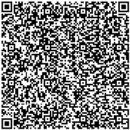

## [红糖云服app下载 https://mp.dagouzhi.com/ ](https://mp.dagouzhi.com/)

### 使用红糖云服app 扫码添加小程序

>更多小程序demo 请查看[https://github.com/htyf-mp-community/demo](https://github.com/htyf-mp-community/demo)

  

<h1 align="center">
  LNReader
</h1>

  LNReader is a Tachiyomi-like, free and open source light novel reader for Android.

  
  
  
  
  
  

 
 

  

## Download

Get the app from our [releases page](https://github.com/rajarsheechatterjee/LNReader/releases).

## Sources

LNReader does not have any affiliation with the content providers available.

Source requests should be created at [LNReader/lnreader-sources](https://github.com/LNReader/lnreader-sources).

## Building & Contributing

See [CONTRIBUTING.md](./CONTRIBUTING.md)

## License

[MIT](https://github.com/rajarsheechatterjee/lnreader/blob/main/LICENSE)
